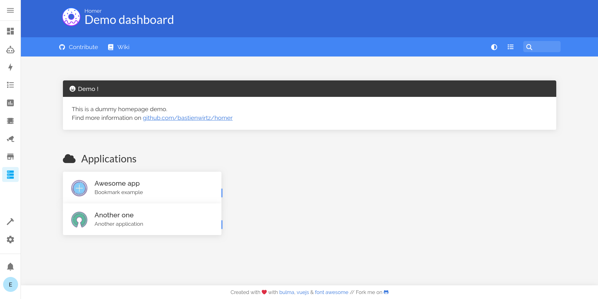

# Homer Dashboard Add-on for Home Assistant  

## About  

[Homer](https://github.com/bastienwirtz/homer) is a fully static HTML/JS dashboard that uses a simple YAML configuration file for customization.  

This add-on installs Homer Dashboard on [Home Assistant OS](https://www.home-assistant.io/addons/), providing access via the sidebar or directly through *host:port*.  

  

## Documentation  

The add-on documentation is available at [DOCS.md](/src/DOCS.md).  

For discussions, [visit the Home Assistant Forum](https://community.home-assistant.io/t/homer-dashboard-add-on-for-home-assistant/815430?u=eskander).  

For configuration options, refer to the official [Homer documentation](https://github.com/bastienwirtz/homer/blob/main/docs/configuration.md).  

## Installation  

