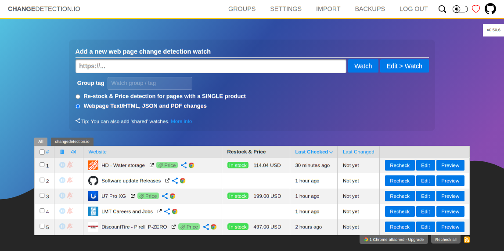

# changedetection.io Add-on for Home Assistant  

## About  

[changedetection.io](https://github.com/dgtlmoon/changedetection.io): Monitor websites for updates — get notified via Discord, Email, Slack, Telegram, Webhook and many more.

This add-on installs changedetection.io on [Home Assistant OS](https://www.home-assistant.io/addons/), providing access via *hostname:port*.

## Documentation  

For configuration options, refer to the official [documentation](https://github.com/dgtlmoon/changedetection.io).
